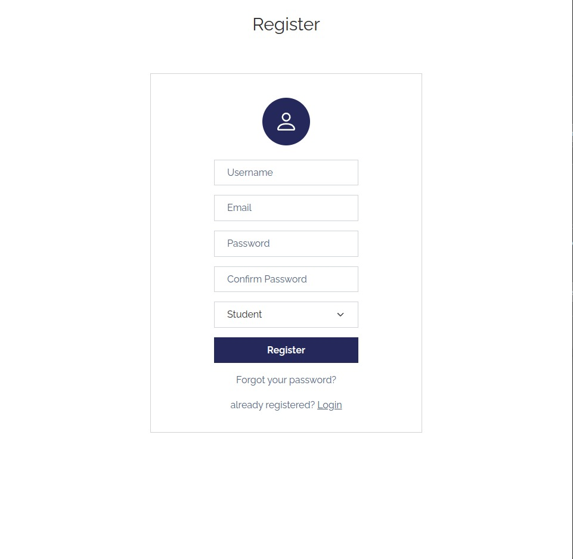
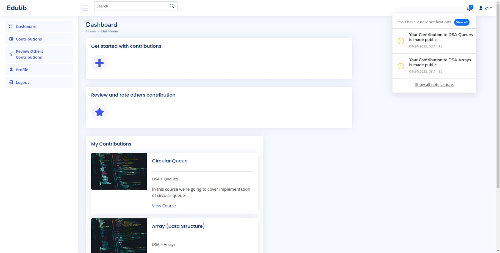
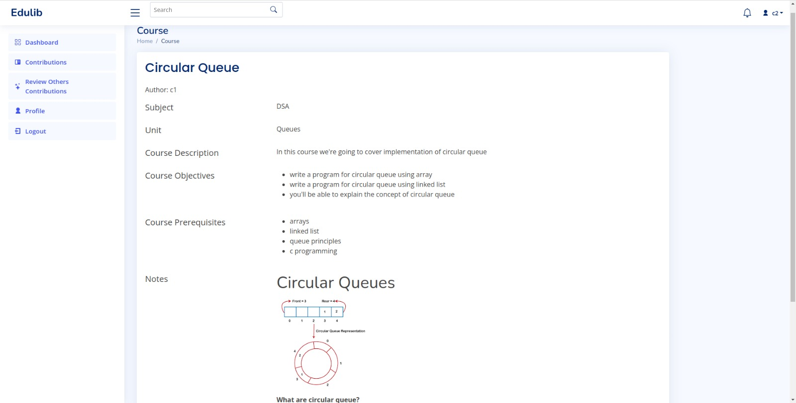

# Python-Project
#Python Mini Project, Group Number 12 , Mentor : Prof. Shiv Negi

# Edulib

## What is Edulib?
* An Open Educational Resource
* A free online educational platform for I.T students that contains curated content only based on the Mumbai University(MU) syllabus

###

|               Features                   | 
|------------------------------------------|
| Includes wide range of materials         | 
| Contains content Evaluated by Evaluators |
| Evaluate effectiveness of OER by reviews |

## Technologies Used :
* Vscode
* Django 5.30
* MySQL 8.0.32
* MongoDB 6.0

###
Team Members - 

Prakhar Sharma : https://github.com/Prakhar29Sharma

Dhaneshwari Tendle : https://github.com/dhaneshwaritendle

Sraina Panchangam : https://github.com/PSraina

Siddesh Patil : https://github.com/siddesh1672003

#

<h2 id="snip">UI-Snippets</h2>
<h3 id = "login_header">Login</h3>

<h3 id = "user_reg_header">User Registration</h3>

<h3 id = "dashobard_header">Dashboard</h3>

<h3 id = "course_header">Course</h3>

